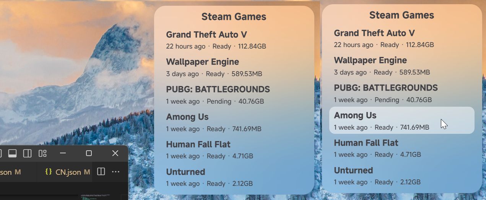

# ***[Desutop](https://github.com/will5933/desutop)***

Here is a **Windows** desktop replacement project built with [Tauri](https://github.com/tauri-apps/tauri), which is currently under active development. It already includes several desktop widgets.

这是一个由 [Tauri](https://github.com/tauri-apps/tauri) 构建的 **Windows** 端桌面替代项目，目前正在努力开发中，目前已拥有多款桌面微件（Widget）。

## *Road Map / 开发路线*

### *Deployed / 已上线*

- [`v0.2.3`](https://github.com/will5933/desutop/releases/tag/v0.2.2) Steam game status display / steam 游戏状态显示
- > 

- [`v0.2.2`](https://github.com/will5933/desutop/releases/tag/v0.2.2) Note widget / 笔记微件

### *Developing / 开发中*

- Installed applications display / 已安装的应用程序显示；
- Language switch / 语言切换；

### *Planned / 计划中*

- Responsive Steam game status display / 响应式Steam游戏状态显示；
- Note widget `Markdown` support / 便签的 `Markdown` 支持；
- Drop-down menu calendar / 下拉菜单日历；
- Custom context menu / 自定义右键菜单；
- Picture paste and fix as a widget / 图片粘贴并作为微件固定；
- System state and notification display / 系统状态和通知显示；
- Better widget alignment / 更好的微件对齐方式；
- Clipboard content display / 剪贴板内容显示；
- Theme color switch / 主题颜色切换；
- Hide or collapse widgets / 隐藏或收起微件。

## *Change wallpaper / 切换壁纸*

> Currently, wallpaper switching can only be done by manually replacing jpg image file.  
> 现在只能手动替换 jpg 图片文件来切换壁纸。
>
> `>` `pic/wp.jpg`

## *Language Support / 语言支持*

> Currently, language switching can only be done by manually replacing the language configuration file.  
> 现在只能手动替换语言配置文件来切换语言。
>
> `>` `locale/default.json`

- `English` *(Default/默认)*
- `简体中文`
