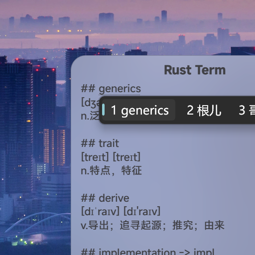

# ***[Desutop](https://github.com/will5933/desutop)***

Here is a **Windows** desktop replacement project built with [Tauri](https://github.com/tauri-apps/tauri), which is currently under active development. It already includes several desktop widgets.

这是一个由 [Tauri](https://github.com/tauri-apps/tauri) 构建的 **Windows** 端桌面替代项目，目前正在努力开发中，目前已拥有多款桌面微件（Widget）。

<table>
  <tr>
    <td></td>
    <td></td>
    <td></td>
  </tr>
  <tr>
    <td></td>
    <td></td>
    <td></td>
  </tr>
  <tr>
    
  </tr>
</table>

## Road Map / 开发路线

- [x] Steam game status display / steam 游戏状态显示；
- [x] Note widget / 笔记微件；
- [x] Better settings / 更好的设置界面；
- [x] Multi-language support / 多语言支持；
- [x] Language switch / 语言切换;
- [x] Wallpaper switch / 壁纸切换;
- [ ] Installed applications display / 已安装的应用程序显示；
- [ ] Responsive Steam game status display / 响应式Steam游戏状态显示；
- [ ] Note widget `Markdown` support / 便签的 `Markdown` 支持；
- [ ] Drop-down menu calendar / 下拉菜单日历；
- [ ] Custom context menu / 自定义右键菜单；
- [ ] Picture paste and fix as a widget / 图片粘贴并作为微件固定；
- [ ] System state and notification display / 系统状态和通知显示；
- [ ] Better widget alignment / 更好的微件对齐方式；
- [ ] Clipboard content display / 剪贴板内容显示；
- [ ] Theme color switch / 主题颜色切换；
- [ ] Hide or collapse widgets / 隐藏或收起微件。

## Change wallpaper / 切换壁纸

> `>` `wallpaper`

## Language Support / 语言支持

- `English` *(Default/默认)*
- `简体中文`
- `繁體中文`
- `Español`
- `Français`
- `日本語`
- `한국어`