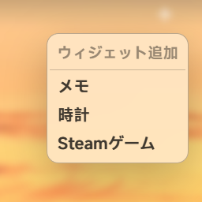
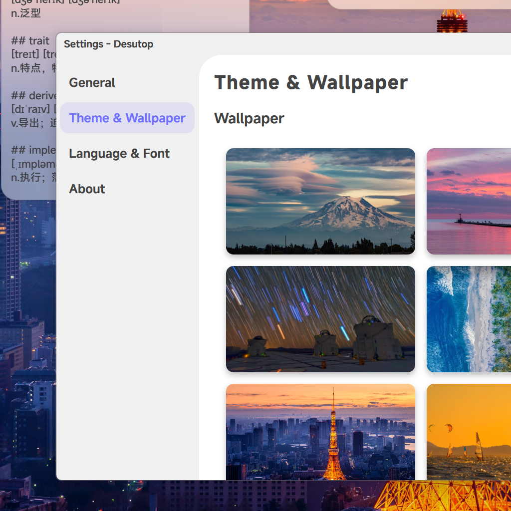
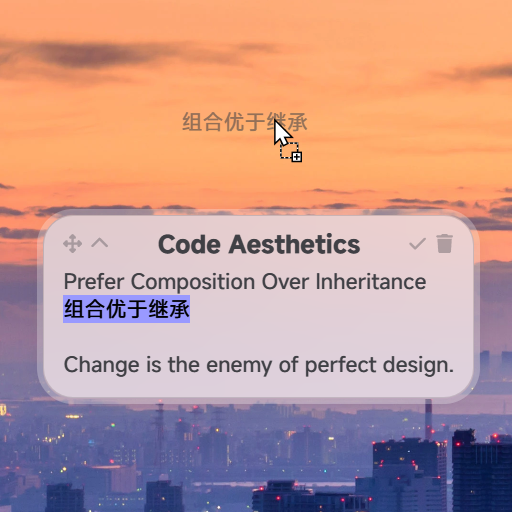
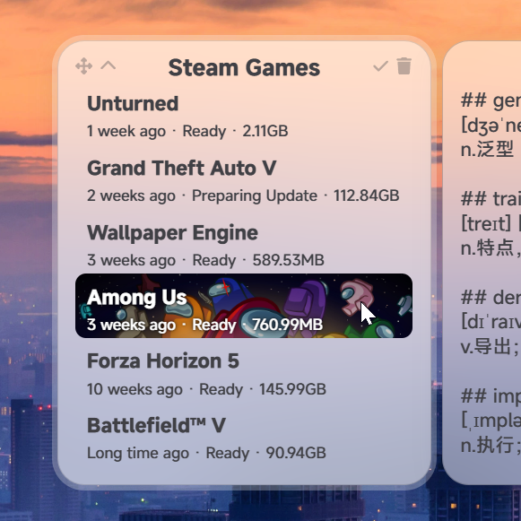

# **[Desutop](https://github.com/will5933/desutop)**

Here is a **Windows** desktop replacement project built with [Tauri](https://github.com/tauri-apps/tauri), which is currently under active development. It already includes several desktop widgets.

<table>
  <tr>
    <td></td>
    <td></td>
  </tr>
  <tr>
    <td></td>
    <td></td>
  </tr>
  <tr>
    <td></td>
    <td></td>
  </tr>
  <tr>
    <td></td>
  </tr>
</table>

## **Tips**

### Markdown Support

Double-click the upper left move button of the widget to read in `Markdown`.

双击微件左上移动按钮进行 `Markdown` 阅读。

>>>>>> ---

### Quick Note-taking

Implement a quick note-taking feature by dragging any text content to the desktop.

通过拖拽任意文字内容到桌面实现快速笔记功能。

>>>>>> ---

### Change Wallpaper

> `/wallpaper`

## **Language Support**

- `English (Default)`
- `简体中文`
- `日本語`